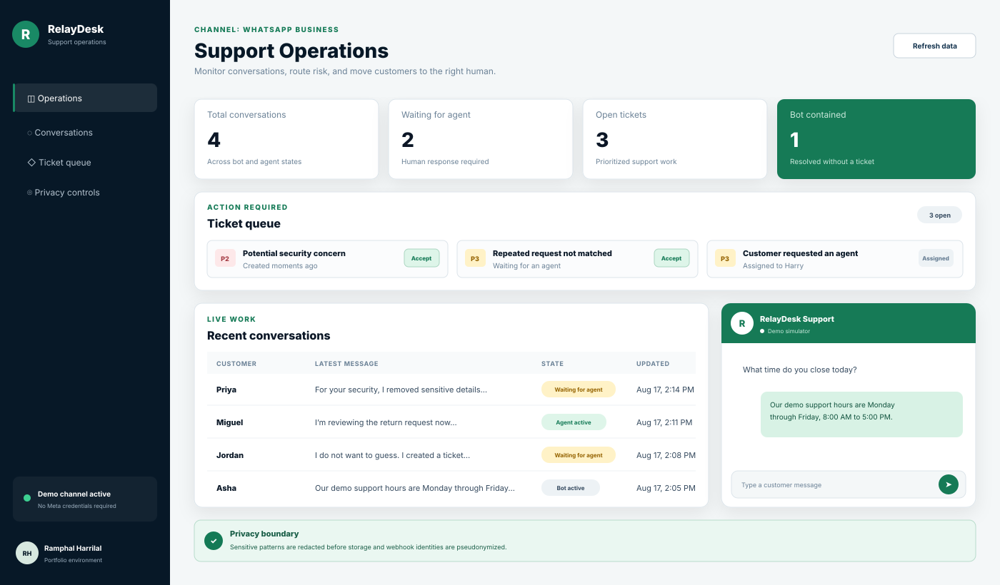
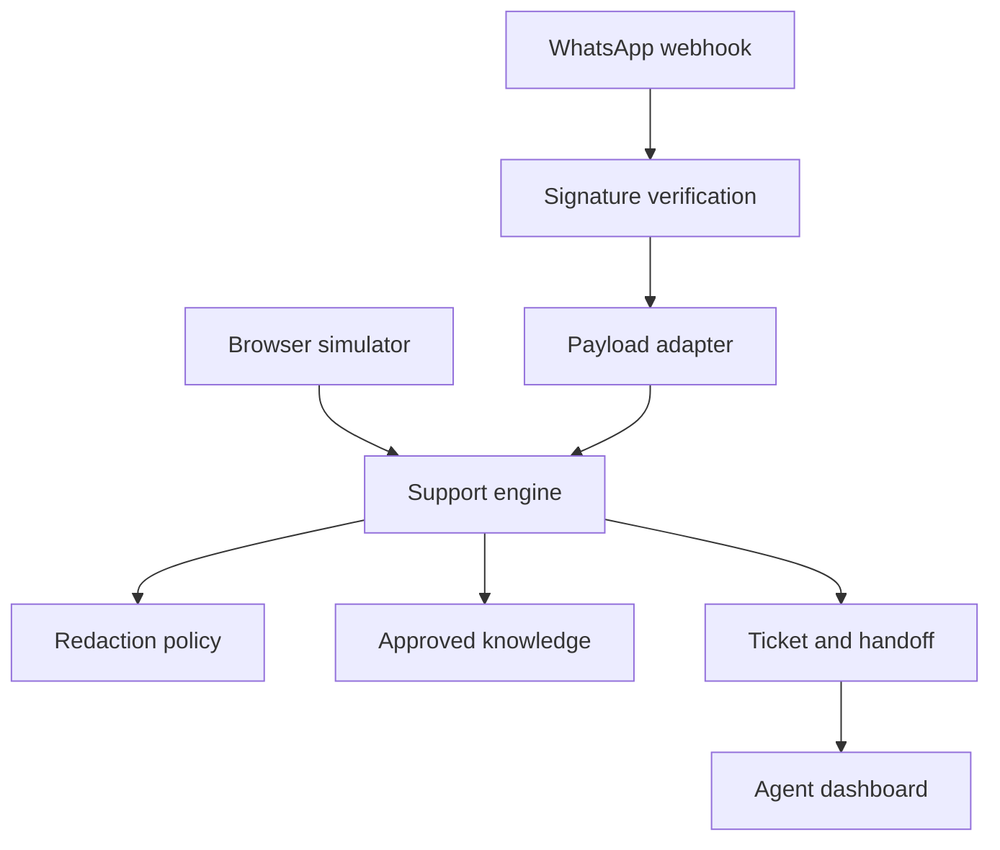

# RelayDesk: WhatsApp Support Operations

[](https://github.com/ramphalharrilal/whatsapp-support-operations/actions/workflows/ci.yml)
[](https://nodejs.org/)
[](LICENSE)

## About

RelayDesk is a privacy-aware customer-support operations system that accepts WhatsApp webhook events, answers only from approved knowledge, creates prioritized tickets, and moves customers into a controlled human handoff.

It is a working portfolio edition with a browser simulator and synthetic data. Demo mode requires no Meta credentials. Production WhatsApp delivery would require an approved Business account and a dedicated outbound provider adapter.



## Business Problem

Small support teams often need more than a chatbot. They need to know which requests can be answered safely, which conversations require a person, why a ticket was created, who accepted it, what was communicated, and whether sensitive data was handled appropriately.

RelayDesk treats automation as one controlled step inside a support operation.

| Need | System response |
| --- | --- |
| Repetitive approved questions | Deterministic knowledge-base answers with recorded intent and confidence |
| Customer requests a person | P3 ticket and immediate human-support queue placement |
| Security or sensitive data appears | Redaction before storage, P2 escalation, and safe customer guidance |
| Bot cannot understand twice | Ticket creation instead of a fabricated answer |
| Agent takes ownership | Ticket assignment, state transition, agent messaging, and audit event |
| Manager needs visibility | Conversation, queue, containment, and response-time metrics |
| Meta sends a webhook | HMAC-SHA256 signature verification and payload normalization |

## Product Capabilities

- Conversation state machine: bot active, waiting for agent, agent active, and resolved
- FAQ routing for hours, orders, returns, and technical support
- Explicit human handoff and repeated-unknown fallback
- P2 and P3 ticket prioritization with assignment and resolution history
- Sensitive-pattern detection and redaction before message storage
- Pseudonymized WhatsApp channel identifiers
- Signed webhook verification and subscription challenge handling
- Browser-based customer simulator and agent operations dashboard
- Security headers, a 1 MB request limit, and no third-party runtime dependencies
- Automated domain, webhook, privacy, and HTTP integration tests

## Architecture



The business rules do not depend on the HTTP server or a specific persistence provider. See [Architecture](docs/architecture.md) for boundaries, state transitions, and production replacements.

## Run the Demo

Requirements: Node.js 22+.

```bash
git clone https://github.com/ramphalharrilal/whatsapp-support-operations.git
cd whatsapp-support-operations
node src/server.js
```

After the server prints `RelayDesk listening on http://localhost:3000`, open `http://localhost:3000` in a browser on that same computer.

> `localhost` is a local development address, not a public website. The link will not work from GitHub unless you first clone the repository and start the server locally.

Try these simulator messages:

- `What time do you close?`
- `I need an agent`
- `The website is not working`
- two unrelated requests in a row to trigger the safe fallback

The application starts with fictional conversations and tickets so the dashboard is useful immediately.

## Test and Validate

```bash
node scripts/validate-repository.js
node --test
```

The test suite covers:

- approved knowledge answers without unnecessary tickets;
- explicit and fallback escalation;
- redaction before storage;
- ticket assignment, agent reply, and resolution;
- audit metadata boundaries;
- webhook signatures and subscription verification;
- WhatsApp payload parsing and identity pseudonymization;
- simulator and dashboard API integration;
- browser security headers.

## Docker

```bash
docker build -t relaydesk .
docker run --rm -p 3000:3000 relaydesk
```

## Webhook Configuration

Copy `.env.example` into the approved secret-management workflow. Do not commit real values.

| Variable | Purpose |
| --- | --- |
| `DEMO_MODE` | Enables seeded data and the browser simulator when `true` |
| `WHATSAPP_VERIFY_TOKEN` | Validates Meta's webhook subscription challenge |
| `WHATSAPP_APP_SECRET` | Verifies `X-Hub-Signature-256` on incoming payloads |
| `PORT` | HTTP port, default `3000` |

Production mode:

```bash
DEMO_MODE=false \
WHATSAPP_VERIFY_TOKEN="managed-secret" \
WHATSAPP_APP_SECRET="managed-secret" \
node src/server.js
```

This repository intentionally does not include a Meta access token or outbound Graph API client. A production team should add a secrets-managed message gateway, durable persistence, authentication, authorization, rate limiting, monitoring, and an approved retention policy.

## API Surface

| Method | Route | Purpose |
| --- | --- | --- |
| `GET` | `/api/health` | Service status and operating mode |
| `GET` | `/api/dashboard` | Metrics, queue, conversations, and recent audit events |
| `GET` | `/api/conversations/:id` | Conversation messages and state |
| `POST` | `/api/simulate/inbound` | Demo-only inbound customer message |
| `POST` | `/api/tickets/:id/assign` | Agent accepts a ticket |
| `POST` | `/api/conversations/:id/agent-message` | Assigned agent sends a reply |
| `POST` | `/api/conversations/:id/resolve` | Resolve conversation and linked ticket |
| `GET` | `/webhooks/whatsapp` | Meta subscription verification |
| `POST` | `/webhooks/whatsapp` | Verified inbound WhatsApp payload |

See [OpenAPI contract](openapi.yaml) for request and response schemas.

## Security and Privacy Boundary

- Message bodies are not written to audit metadata.
- Common passwords, verification codes, card-number patterns, and email addresses are redacted before conversation storage.
- WhatsApp phone numbers are converted to one-way pseudonymous identifiers before entering the support domain.
- Webhook signatures are checked with constant-time comparison when an application secret is configured.
- The browser simulator is disabled when `DEMO_MODE=false`.
- The server sets CSP, frame, MIME-sniffing, permissions, and referrer protections.

Read [Security and Privacy](docs/security-and-privacy.md) before adapting the system.

## Case Study and Operations

- [Product case study](docs/product-case-study.md)
- [Architecture and state model](docs/architecture.md)
- [Security and privacy design](docs/security-and-privacy.md)
- [Operations runbook](docs/operations-runbook.md)

## Portfolio Disclaimer

All names, conversations, ticket reasons, identifiers, and operational values are synthetic. WhatsApp is a trademark of Meta Platforms, Inc. This independent portfolio project is not affiliated with or endorsed by Meta or WhatsApp.

Built by [Ramphal Harrilal](https://ramphalharrilal.github.io/).
