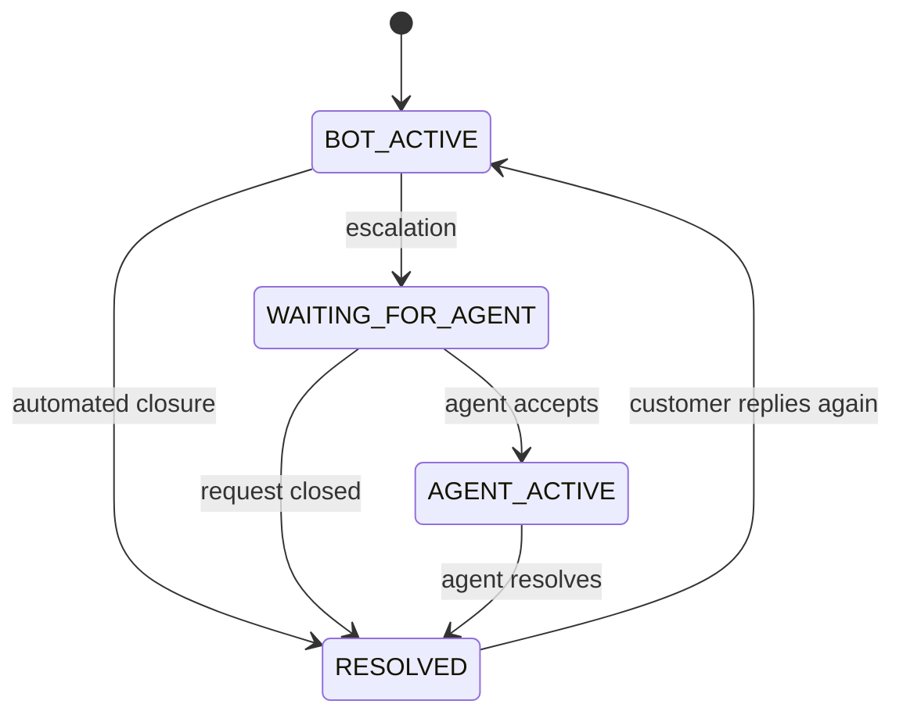
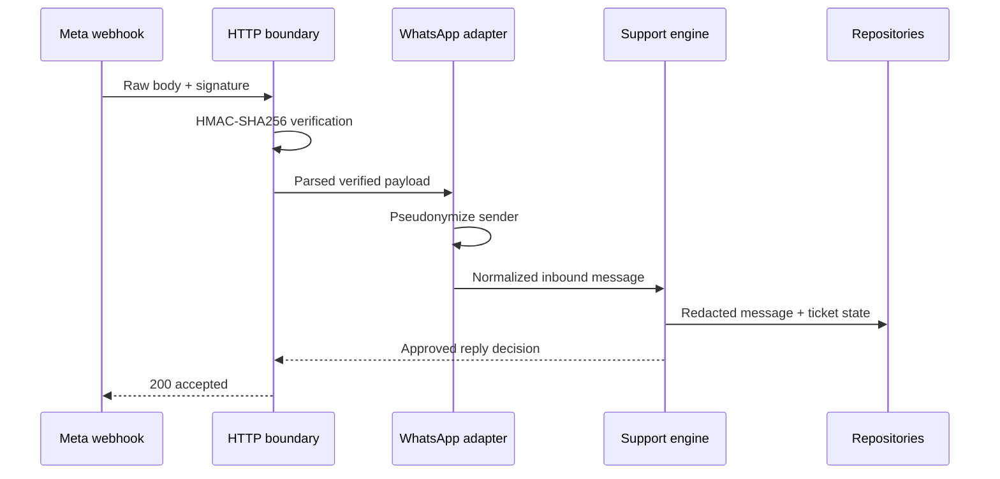

# Architecture and State Model

## Design Goals

RelayDesk separates channel transport, business decisions, support records, and presentation so each can change independently.

1. Webhook-specific objects must not leak into the support domain.
2. Automation may answer only from approved deterministic knowledge.
3. Human handoff must be a first-class state, not a fallback message with no owner.
4. Sensitive patterns must be reduced before storage and logging.
5. Every ticket assignment and resolution must leave an auditable event.
6. The public demo must run without live credentials or customer data.

## Component Boundaries

| Layer | Responsibility | Current implementation | Production replacement |
| --- | --- | --- | --- |
| Channel adapter | Verify and normalize external events | WhatsApp signature and payload adapter | Meta Cloud API client plus retry queue |
| Application | Decide reply, escalation, assignment, and resolution | `SupportEngine` | Same domain service behind workers or API |
| Domain | Enforce conversation and ticket transitions | Conversation and ticket classes | Same rules with persisted entities |
| Privacy | Detect and reduce sensitive content | Pre-storage redaction and address hashing | DLP service, tokenization, policy engine |
| Persistence | Store conversations, tickets, and audit events | In-memory repositories | PostgreSQL plus encrypted fields and retention jobs |
| Presentation | Agent visibility and demo interaction | Server-rendered static dashboard | Authenticated operations frontend |

## Conversation State Machine

Invalid transitions throw an error rather than silently producing contradictory state.

## Inbound Decision Order

The order is intentional:

1. Validate required identifiers and message text.
2. Reopen a previously resolved conversation when the customer replies.
3. Redact sensitive patterns before storing the inbound message.
4. Escalate potential security or sensitive-data concerns as P2.
5. Respect an active or waiting human handoff.
6. Honor an explicit request for an agent.
7. Search only approved knowledge patterns.
8. Ask for clarification once.
9. After a second unmatched request, create a P3 ticket rather than guessing.

## Webhook Trust Boundary

The demo returns the outbound decision in the webhook response for inspection. Production delivery should place that decision on a retry-capable outbound queue and call the approved Meta Graph API through a dedicated gateway.

## Failure Handling

- Invalid JSON or required input returns `400`.
- Invalid signed payload returns `401`.
- Oversized request body returns `413`.
- Missing entity returns `404`.
- Invalid business-state action returns `409`.
- A message type other than text is safely ignored by the current adapter.

Production systems should add correlation IDs, structured logging, dead-letter queues, idempotency by source message ID, health dependencies, and service-level telemetry.
